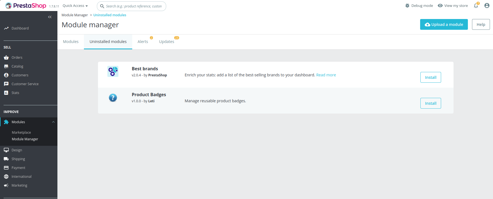
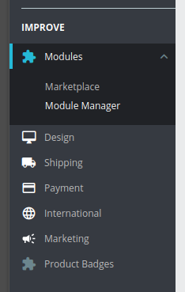
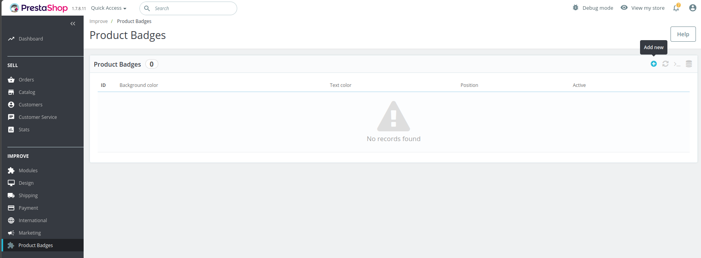
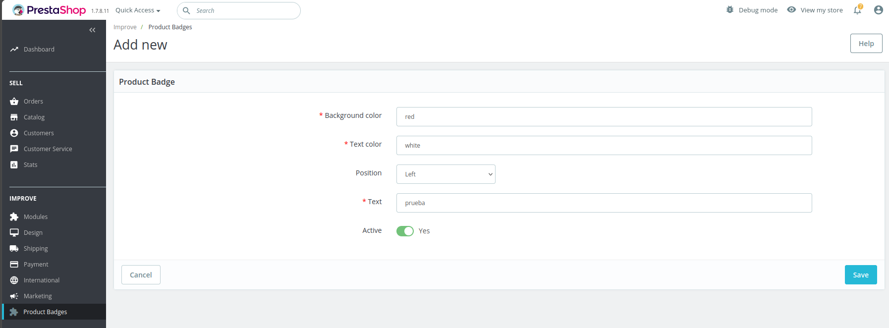
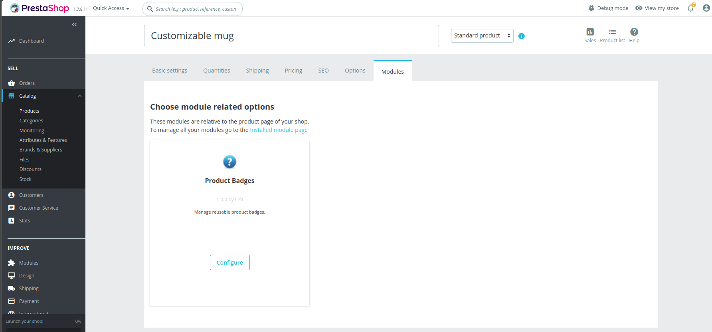
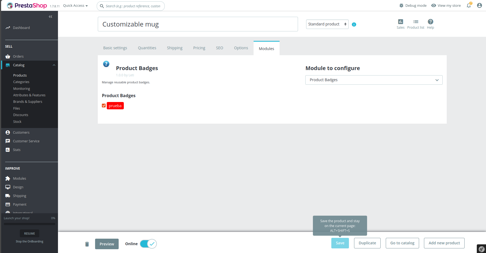
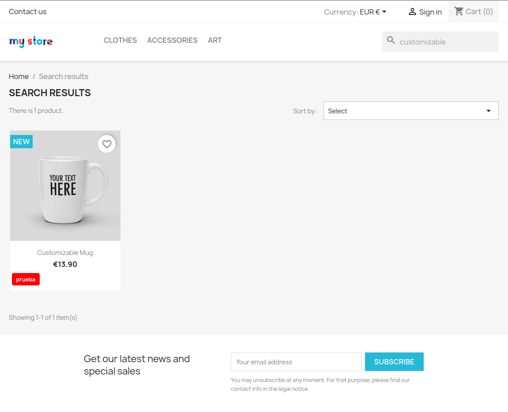
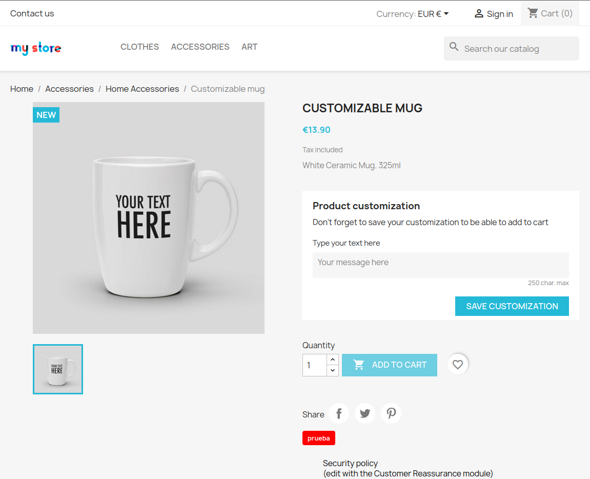

# Product Badges Module for PrestaShop 1.7

Módulo personalizado para PrestaShop 1.7.8.x que permite crear y gestionar etiquetas visuales reutilizables (badges) para productos del catálogo.

---

## 🚀 Requisitos

- Docker Engine (recomendado >= 24.x)
- Docker Compose v2 (>= 2.20)
- Git

Probado con:

- PHP: 7.4 (contenedor)
- PrestaShop: 1.7.8.11
- MySQL: 5.7

---

## 📦 Instalación del proyecto

### 1. Clonar el repositorio

```bash
git git@github.com:Leticia-GA/productbadges.git
cd productbadges
```
⚠️ Asegúrate de ejecutar este comando en la carpeta donde se encuentra el archivo `docker-compose.yml`.

### 2. Levantar entorno Docker
```bash
docker compose up -d
```

Esto levantará:

- PrestaShop en: http://localhost:8080
- Base de datos MySQL

### 3. Acceder a PrestaShop
Una vez iniciado el contenedor:
- Front office: http://localhost:8080
- Back office: http://localhost:8080/admin123
    - usuario: `demo@prestashop.com`
    - password: `prestashop_demo`

## 🧩 Instalación del módulo
1. Entrar al backoffice
2. Ir a “Módulos” → “Gestor de módulos”
3. Buscar "Product Badges"



4. Click en instalar

5. Aparecerá el nuevo módulo en el menú



6. Añadir una nueva etiqueta rellenando los campos y guardar




7. Entrar en la edición de cualquier producto, buscar el módulo "Product Badges", configurarlo con las etiquetas creadas y guardarlo.




8. En el front del producto aparecerán las etiquetas customizadas




## ⚙️ Funcionalidad del módulo

Una vez instalado:

- Permite crear badges reutilizables
- Define:
    - Texto
    - Color de fondo
    - Color de texto
    - Posición (izquierda/derecha)
    - Estado activo/inactivo
- Asignación a productos
- Visualización en frontend mediante hooks

## 🧪 Notas de desarrollo

Este proyecto ha sido desarrollado con ayuda de herramientas de IA, pero todo el código ha sido revisado manualmente y validado para compatibilidad con PrestaShop 1.7.8.x.

Ver archivo `IA.md` para detalle del uso de IA y errores detectados.

## 👤 Autor

Leticia González Álvarez (prueba técnica Product Badges - PrestaShop Developer Task)